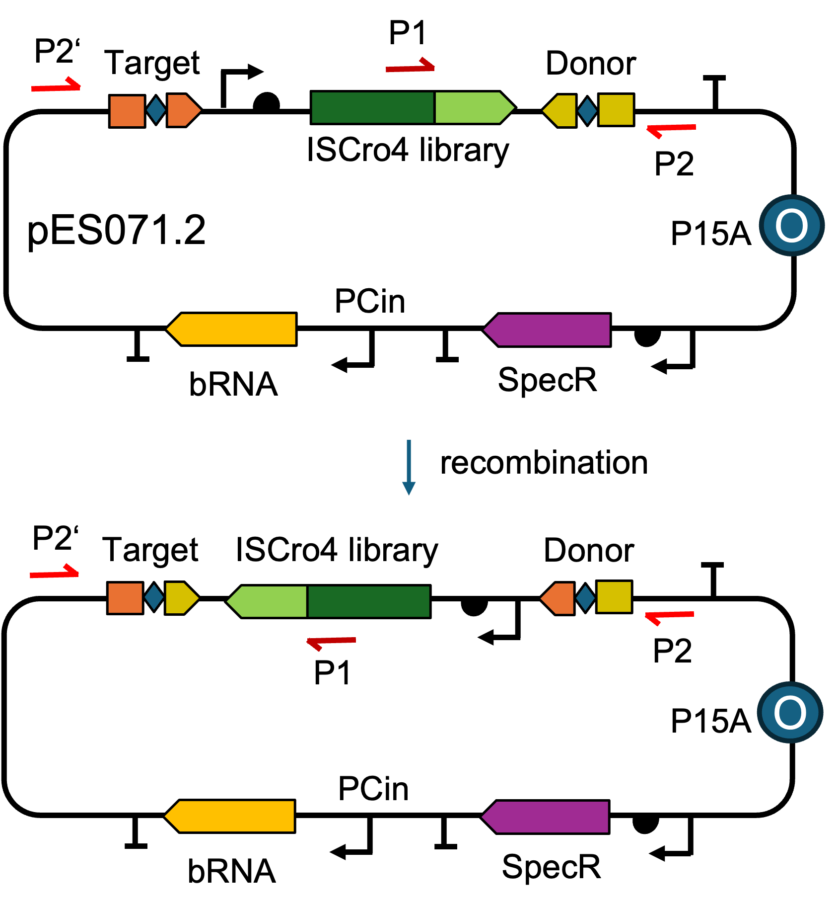
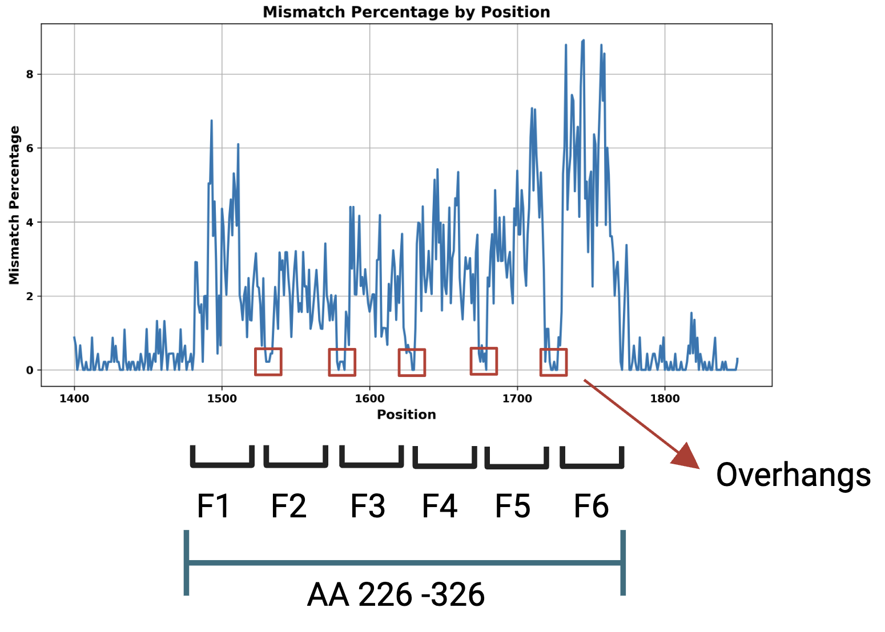
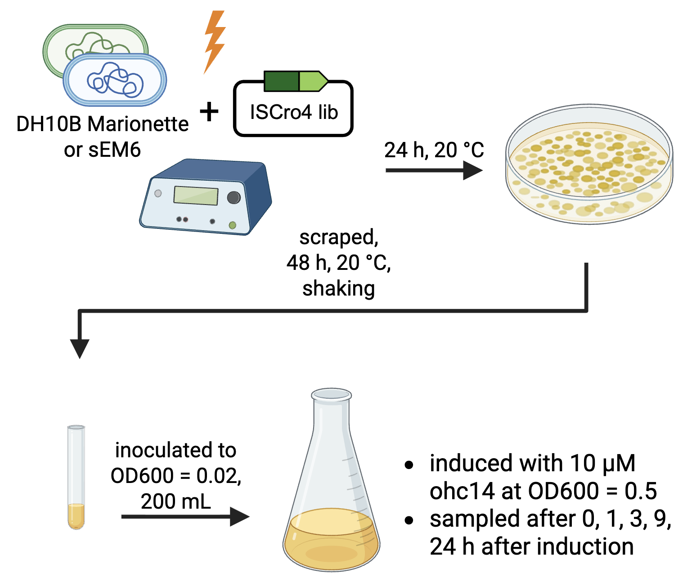
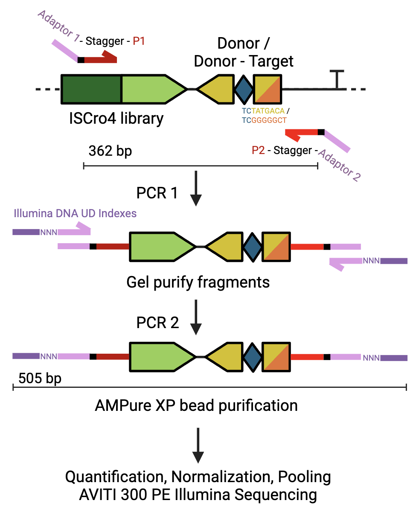
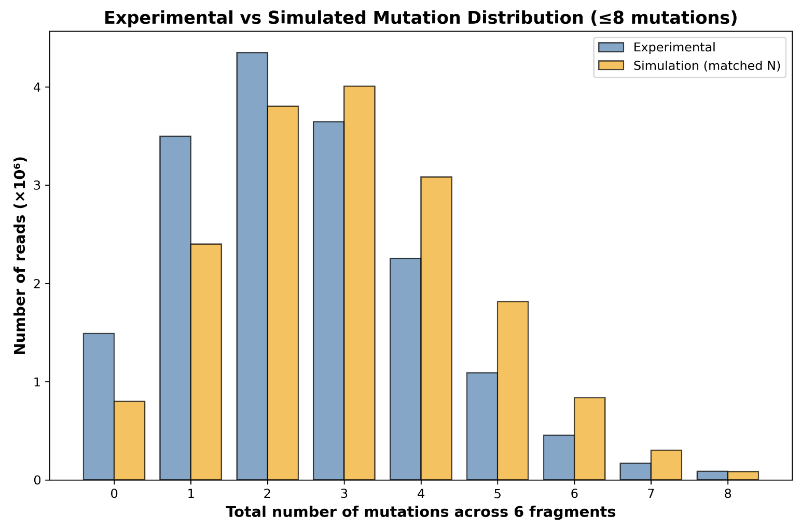

# Deep Mutational Learning of the bridge recombinases fitness landscape
## High throughput efficiency data for bridge recombinases
DE offers a powerful strategy to increase the fitness of proteins \cite{selles_vidal_primer_2023}. While most approaches are restricted to finding optima within local regions of the fitness landscape, machine learning offers an opportunity to broadly explore the fitness landscape and capture epistatic effects \cite{li_evaluation_2025}. Combining ML-based exploration to sample functional sequence space with highly efficient DE methods to refine and optimize variants toward local optima represents a powerful and complementary approach for protein engineering.

<figure markdown>

<figcaption> Figure 1: Overview of learning the fitness landscape of bridge recombinases.
</figcaption>
</figure>
## Connect efficiency of bridge recombinases to the genetic variants

<figure markdown>
{width=800px}
<figcaption> Figure 2: Plasmid encoding the logic for the efficiency assay of the ISCro4.
</figcaption>
</figure>

## library design

<figure markdown>

<figcaption> Figure 3: ISCro4 library design and assembly.
</figcaption>
</figure>

<figure markdown>

<figcaption> Figure 4: Per-position mismatch rate after cloning and long-read sequencing.
</figcaption>
</figure>

## Efficiency Assay

<figure markdown>

<figcaption> Figure 5: Workflow scheme of the transformation and cultuvation of host strains.
</figcaption>
</figure>

## Deep sequencing strategy

<figure markdown>

<figcaption> Figure 6: Logic of the Illumina Sequencing library preparation.
</figcaption>
</figure>

## preliminary Illumina results

<figure markdown>

<figcaption> Figure 7: Experimental and simulated distribution of total number of mutations for each gene variant.
</figcaption>
</figure>

## old text from report:

Previous work has performed a deep mutational scan of the ISCro4 recombinase and demonstrated that the C-terminal region of the TnP domain is especially tolerant to mutations \cite{Durrant2024BridgeRNA}. Building on this insight, we set the goal of designing and screening an unbiased library that samples a distribution of mutations across the majority of the TnP domain rather than being restricted to single amino acid substitutions. The library is evaluated in an inversion-based functional assay, where successful recombination events are encoded in a DNA sequence motif. Therefore, the variant and it's inversion activity are both encoded on the DNA sequence and can be identified NGS. 

The resulting labelled dataset can be used to train machine learning models that capture the underlying fitness landscape, including epistatic effects extending beyond single mutations, hence the term Deep Mutational Learning (DML) \cite{Frei2025}. Through this approach, we aim to develop a computational tool for broadly sampling functional sequences from the fitness landscape. These sequences can then be further optimized towards their local optima using the evolution logics described above.

\subsubsection{Results}
We aim to couple an unbiased ISCro4 variant library (genotype) with its corresponding functional states (phenotype) directly at the DNA level through our assay design. This strategy generates a genotype–phenotype–linked dataset via NGS. On this basis, a machine learning model can be trained to capture epistatic interactions among multiple mutations and to broadly explore the underlying fitness landscape. From the model’s latent space, we can then sample variants predicted to exhibit enhanced performance (Figure 11A).

Our sequence-based functional assay encodes the ISCro4 variant library, the corresponding ISCro4 bRNA, target Sequence, and the IS621 wild-type donor sequence on a single plasmid, pES071.2 (Figure 11B). The bRNA recognizes both the target and donor sequences, which are essential for mediating inversion. The donor sequence is located in close proximity to the ISCro4 library variants. This spatial arrangement ensures that the presence or absence of an inversion event can be directly linked to the sequence of the corresponding variant. This design further enables direct assessment of both genotype and phenotype with high-quality short-read sequencing.

A mutagenesis library covering the majority of the TnP domain of ISCro4 (amino acids 226 - 326) was constructed. The mutagenized region was divided into six fragments, and for each fragment three oligo pools were synthesized: one containing only wild type sequences, one containing all possible single-point mutations, and one containing all possible double-point mutations (Figure 11 C). These pools were PCR amplified and then mixed at a ratio of 60\% wild type, 30\% single mutant, and 10\% double mutant to yield a final pool per fragment. The resulting six pooled fragments were then combined in a Golden Gate cloning reaction to assamble the library (Figure 11 D). This library assembly approach and mixing ratio enables a broad distribution of mutations across all variants, thereby increasing the likelihood of capturing epistatic effects with the ML model \cite{Li2025MLDE}. 

Successful assembly of the mutagenesis library was confirmed by long-read Oxford Nanopore sequencing (Figure 11E). The mismatch percentage relative to the wild type sequence was plotted across mutagenized region of the ISCro4. As expected, the regions targeted for mutagenesis displayed a marked increase in mismatch frequency (position 1480 - 1780), confirming the introduction of mutations into the library. In contrast, the cut site overhangs, where no mutations were introduced, showed much lower mismatch percentages, consistent with the preservation of the wild type sequence. This pattern validates that the designed variant space was specifically incorporated at the intended positions while non-targeted regions remained largely unaltered.

Next, we transformed \textit{E. coli} Marionette-Clo and sEM6 strains with pES071.2, scraped and cultured the bacteria (Figure 11F). After induction with OHC14 the bRNA is transcribed and recombination can occur. The ISCro4-bRNA complex inverts the DNA sequence flanked by the target and donor sequences right after their CT core. This includes the ISCro4 gene.

After execution of the functional assay, a NGS library preparation was performed to recover the screened variants and their functional states. Therefore, primers with Nextera Transposase Adaptors anneal to the plasmid to amplify the library fragment for subsequent sequencing (as indicated in Figure 11G).  Index Primer 1 (P1) anneals in the ISCro4 gene right before the start of the library fragments. Index Primer 2 anneals twice on the plasmid, before the target sequence (P2') and after the donor sequence (P2) on the reverse stand (as indicated in Figure 11H). The PCR results in a 362 bp long product, regardless of whether the plasmid sequence was the original, P1 - P2, or inverted, P1 - P2' (Figure 11 H). The PCR products of the original or inverted plasmids differ by the first 7 bp before the CT core in the donor or target region, as these nucleotides are not affected by the inversion. Therefore, these PCR products serve as binary markers, encoded on the DNA sequence, indicating whether an inversion has occurred. The PCR product is amplified a second time using Illumina DNA / RNA UD Indexes, gel and bead purified and submitted for Illumina sequencing. A representative fragment analyser quality control trace is shown in Figure 11I, with the main peak corresponding to the expected fragment length and the appropriate concentration for flow cell loading. 

Sequencing across all submitted samples yielded approximately 300 million reads, confirming successful library preparation. Analysis of the mutation distribution across all reads for the uninduced sample revealed that the majority of assemblies contained two to three mutations, with fewer variants carrying four or more mutations (Figure 11 H). Only a small fraction of reads contained zero or more than six mutations. This pattern closely matches the expected distribution derived from \textit{in silico} simulations of the fragment pooling ratios (60\% wild type, 30\% single mutant, 10\% double mutant). When comparing experimental sequencing data to the simulated distribution, both showed a peak around two to three mutations per variant, confirming that the designed mixing ratios were faithfully represented in the assembled library. The remaining samples are currently being processed at the Genomics Facility Basel and will be analyzed to generate the training dataset for machine learning. 

## References
